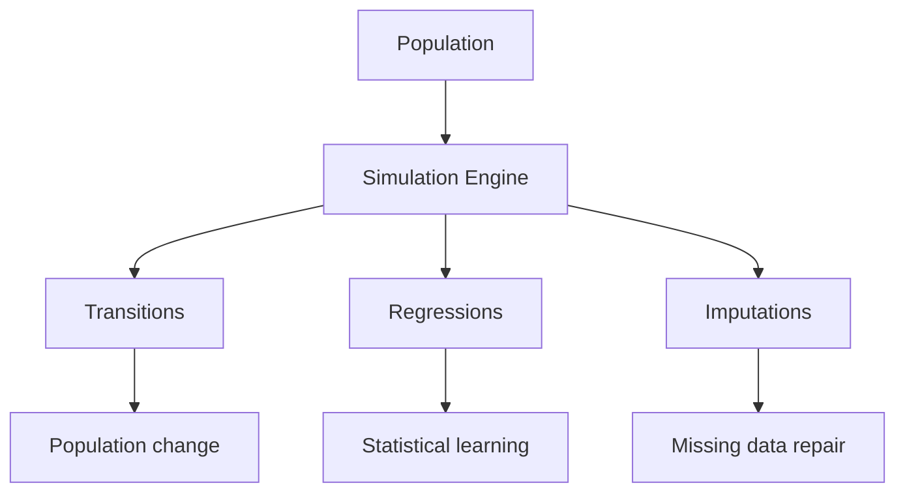

# HERMES
## Hierarchical Economic and Residential Microsimulation for Small areas

```
     ___         ___         ___         ___         ___         ___     
    /__/\       /  /\       /  /\       /__/\       /  /\       /  /\    
    \  \:\     /  /:/_     /  /::\     |  |::\     /  /:/_     /  /:/_   
     \__\:\   /  /:/ /\   /  /:/\:\    |  |:|:\   /  /:/ /\   /  /:/ /\  
 ___ /  /::\ /  /:/ /:/_ /  /:/~/:/  __|__|:|\:\ /  /:/ /:/_ /  /:/ /::\ 
/__/\  /:/\:/__/:/ /:/ //__/:/ /:/__/__/::::| \:/__/:/ /:/ //__/:/ /:/\:\
\  \:\/:/__\\  \:\/:/ /:\  \:\/:::::\  \:\~~\__\\  \:\/:/ /:\  \:\/:/~/:/
 \  \::/     \  \::/ /:/ \  \::/~~~~ \  \:\      \  \::/ /:/ \  \::/ /:/ 
  \  \:\      \  \:\/:/   \  \:\      \  \:\      \  \:\/:/   \__\/ /:/  
   \  \:\      \  \::/     \  \:\      \  \:\      \  \::/      /__/:/   
    \__\/       \__\/       \__\/       \__\/       \__\/       \__\/    

```

[](https://www.python.org/)
[](#)
[](https://ns.org/licenses/by/4.0/)

## 1. What is HERMES?

HERMES is an extensible population modelling platform designed for fast, efficient modelling of demographic processes to support policy and population health research. HERMES consists of three complementary modelling strands:

HERMES consists of three complementary modelling strands:

* 🌍 **Dynamic microsimulation**
* 📈 **Regression modelling**
* 🧩 **Imputation**



## 2. Architecture

HERMES is organised around a small number of core concepts.

| Component                      | Purpose                                                                                                                                                                                                                                                                                                                                                                                                                                       |
|--------------------------------|-----------------------------------------------------------------------------------------------------------------------------------------------------------------------------------------------------------------------------------------------------------------------------------------------------------------------------------------------------------------------------------------------------------------------------------------------|
| 📚 **Library**                 | HERMES is provided with a library of transition models and demonstration scenarios. Models currently cover a range of basic demographic processes - birth, mortality, migration, transition to adulthood and educational progression. Users can combine these building blocks to create their own simulation scenarios, with each transition model acting on one or more domains - that is, variables representing aspects of people's lives. |
| 🪐 **Universes**               | Populations, configuration files, rate tables, regressions and transition models are organised into self-contained *universes*. HERMES includes a fully open-source `core` universe based on the fictional island of Meropis, generated using the [COMPASS]([COMPASS](https://github.com/ricci-colasanti/COMPASS)) synthetic population framework.                                                                                            |
| 💻 **Command-line Interface**  | HERMES provides a consistent command-line interface through `hermes-run`, `hermes-regress` and `hermes-impute`, corresponding to the three modelling strands.                                                                                                                                                                                                                                                                                 |
| 🔌 **Sources**                 | Transition models can be driven by analytic functions, empirical rate tables or statistical regression models, allowing users to combine built-in functionality with their own custom components.                                                                                                                                                                                                                                             |
| ✅ **Verification Framework**  | HERMES performs extensive pre-flight and runtime verification. Bespoke error messages are designed to be clear, succinct and informative rather than punitive, helping users identify and correct problems quickly.                                                                                                                                                                                                                           |


**3. Installation**

The simplest way is to install via `pip`. First create a suitable Python environment using `conda` or `venv`, for example, then run the following command. Ensure your Python version is 3.12 or later.

```
pip install git+https://github.com/paddy-r/HERMES.git
```

Alternatively, if you'd like to contribute to the development of HERMES, clone the repository using Git, then install it in development mode, as follows.

```
git clone https://github.com/paddy-r/HERMES.git
pip install -e .
```

**4. Dynamic microsimulation framework**

*Tip:* Users execute HERMES regressions via the command `hermes-run` along with required fields: the universe in which the microsimulation will run, and which scenario should be run, where a scenario is defined by a config file specifying (a) the input population, and (b) a set of transition models, including any model parameters that are required. Users can type `hermes-run --help` at the command line for more information.

*Quick start guide*

HERMES' `core` universe contains a library of files for you to build a range of demographic scenarios. It contains (a) a population (`population.csv`), (b) a library of transitions models in the `transitions` folder, and (c) a set of config files in the `configs` folder, each corresponding to a different simulation scenario, in which you can also specify the order in which transtion models are applied to the population.

To familiarise yourself with how the HERMES microsimulation engine works, follow the instructions in the table below. Each scenario is designed to be more complex than the last, beginning with a simple case of a mortality model, and ending with a complete demographic projection. For each scenario, the command is given that the user should execute to run it, where the `-c` flag indicates the name of the corresponding config file.

| Example                        | Difficulty   | Command                                                   | Description                                                                                                                                                                                                                                                                                                                                                                                                       | Lesson                                                                                                                                                                                                                          |
|--------------------------------|--------------|-----------------------------------------------------------|-------------------------------------------------------------------------------------------------------------------------------------------------------------------------------------------------------------------------------------------------------------------------------------------------------------------------------------------------------------------------------------------------------------------|---------------------------------------------------------------------------------------------------------------------------------------------------------------------------------------------------------------------------------|
| 1️⃣  **Mortality**               | Beginner     | `hermes-run -u core -c mortality_gompertz_makeham`        | A simple mortality transition model acting on the input population, constructed using HERMES' functional archetypes. The model is of the Gompertz-Makeham kind, which is a special case of an exponential with a constant term, taking the form $m(a) = \alpha + \beta e^{\gamma a}$, where $m$ is the hazard (i.e. probability of death), $a$ is age in years, and $\alpha$, $\beta$ and $\gamma$ are parameters | Learn the basic structure of a HERMES simulation and how transition models operate on population domains. You should see a mortality rate of about 1%.                                                                          |
| 2️⃣  **Mortality (alternative)** | Beginner     | `hermes-run -u core -c mortality_gompertz_makeham_custom` | An alternative form of mortality model constructed using HERMES' `expression` functionality, which allows users to create their own domain dependence, including multivariate functions, and allowing safe evaluation.                                                                                                                                                                                            | Understand how transitions and the sources that drive them are related in HERMES. You should see a very similar mortality rate to the previous example.                                                                         |
| 3️⃣  **Time-advance model**      | Beginner     | `hermes-run -u core -c time_stochastic`                   | A time-advance transition model, which increments people's ages deterministically by one, and their income stochastically by applying an inflation rate of 2%.                                                                                                                                                                                                                                                    | You should see a gradual increase in mean income at each iteration of the simulation.                                                                                                                                           |
| 4️⃣  **Fertility**               | Intermediate | `hermes-run -u core -c time_mortality_fertility`          | Introduces births and dynamic population growth through a fertility model, including imputation of newborn characteristics.                                                                                                                                                                                                                                                                                       | Learn how HERMES creates new agents.The scenario also includes time-advance and mortality models, and the mortality and fertility models will act to decrease and increase the living population size, respectively.            |
| 5️⃣  **Complete demography**     | Intermediate | `hermes-run -u core -c demography_complete`               | Runs the complete demographic model suite, demonstrating a full life-course simulation. Includes time-advance (ageing and income inflation), transition to adulthood, education, migration (internal, inward and outward) and mortality.                                                                                                                                                                          | Understand how multiple transition models interact to create a realistic life-course simulation, and how HERMES models geographical movement (migration).                                                                       |
| 6️⃣  **Build your own scenario** | Advanced     | `hermes-run -u core -c your_core_config`                  | Create and run your own microsimulation scenario. Create a new config file, then copy, paste and modify a set of transition models of your choice from others in the `core` universe. You can specify any order for the transition models to be applied and the number of iterations over which the simulation will run, for example.                                                                             | Learn how to combine transition models, rate sources and predict the life course of your population.                                                                                                                            |
| 7️⃣  **Build your own universe** | Advanced     | `hermes-run -u your_universe -c your_universe_config`     | Develop your own simulation universe. Create a new folder called `your_universe` next to `core` with the same structure as the `core` universe, then add a population, a new config file and a set of transition models as in the previous example.                                                                                                                                                               | Develop an entire self-contained ecosystem, independent of the HERMES library. A longitudinal population dataset will be produced in the `output` folder, labelled with a timestamp, universe and config, for future reference. |

**6. Regression framework (in development)**

*Tip:* Users execute HERMES regressions via the command `hermes-regress` along with required fields: the training dataset, predictor and response variables, and the type of regression to be fitted. Users can type `hermes-regress --help` at the command line for more information.

- *Currently implemented:* Linear regression model.
- *In development:* Logistic regression model, fixed effects model, random effects model, survival model and event history model.

*Quick start guide*

The table below shows an example that users can follow. It explains the stages of building and applying a regression model, in the case below, a linear model.

| Step                                                    | Command                                                                                                                                          | Description                                                                                                                                                                                    | Lesson                                                                                                                                                                                               |
|---------------------------------------------------------|--------------------------------------------------------------------------------------------------------------------------------------------------|------------------------------------------------------------------------------------------------------------------------------------------------------------------------------------------------|------------------------------------------------------------------------------------------------------------------------------------------------------------------------------------------------------|
| 1️⃣  **Create longitudinal dataset**                      | `hermes-run -u core -c time_stochastic_getclones`                                                                                                | Run in microsimulation mode to create a longitudinal dataset to train a regression model.                                                                                                      | As in the microsimulation examples, this produces a population at N time points, with persistent personal and household identifiers. A 2% Gaussian inflation rate is applied to the `income` domain. |
| 2️⃣  **Train regression model**                           | `hermes-regress -u core -c time_stochastic_getclones -r linear -p income -e income_next --uid level_1_uid`                                       | Run the regression engine with a linear model to produce a result that can be used later. We use a training dataset produced by HERMES here, but the dataset you use can come from any source. | A model is created in the `regressions` folder of the specified universe. The parameters are stored in a `pkl` files, and metadata in a `json` file.                                                 |
| 3️⃣  **Apply regression model in microsimulation**        | `hermes-run -u core -c time_stochastic_regression`                                                                                               | The regression model computed in the previous steps is applied to the `income` domain at runtime.                                                                                              | You should see an inflation rate in the `income` domain that matches the ground-truth value specified in the first step (i.e. 2%).                                                                   |

**7. Imputation framework (in development)**

*Tip:* Users execute HERMES imputations via the command `hermes-impute` along with required fields: the universe in which the imputation should operate, the dataset and variables on which the imputation is to be performed, and the type of imputation. Users can type `hermes-impute --help` at the command line for more information.

- *Currently implemented:* Basic runtime imputation for any transition models in HERMES library in which missingness arises (i.e. coming of age, and newborns in the fertility models).
- *In development:* Runtime and pre-processing imputation functionality based on Scikit-learn `SimpleImputer`, including MICE imputation.

*Quick start guide*

Details of a simple example of imputation to go here.

**8. History of HERMES and how to contribute**

HERMES has been developed for use within the [PHI-UK research consortium](https://www.phiuk.org/), "Innovating with people, places and communities".

We warmly welcome contributions and suggestions from users, especially regarding bugs, issues and ideas for future functionality. Contact the development team below with queries, or raise an issue here directly and we will reply. See the installation instructions above for installing HERMES in development mode

- Hugh P. Rice (lead), h.p.rice@leeds.ac.uk
- Ric Colasanti, r.l.colasanti@leeds.ac.uk
- Andreas Hoehn, andreas.hoehn@glasgow.ac.uk
